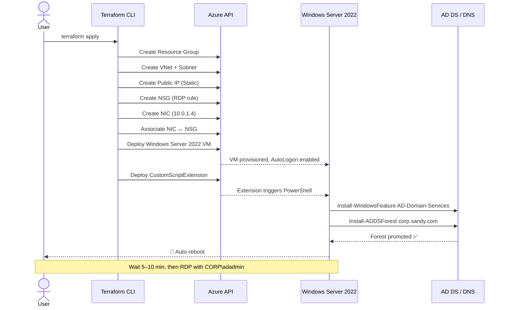

# 🏛️ Architecture Diagram — Azure AD Domain Controller Lab

> Visual reference for all infrastructure deployed by this Terraform lab.
> All resources are provisioned in a single `terraform apply`.

---

## 🗺️ High-Level Architecture

This lab provisions a fully automated Active Directory environment on Microsoft Azure using Terraform as the sole deployment tool. 

At its core, a Windows Server 2022 virtual machine sits inside a dedicated Virtual Network (10.0.0.0/16), isolated within a single subnet (10.0.1.0/24) and protected by a Network Security Group that permits inbound RDP traffic on port 3389. 
The VM is assigned a static private IP (10.0.1.4) via its network interface and is reachable from the internet through a Standard Static Public IP. 

Once the VM is online, a Custom Script Extension automatically executes a PowerShell command that installs the AD DS role, configures integrated DNS, and promotes the server to the root of a new Active Directory forest (corp.sandy.com, NetBIOS: CORP) — all within a single terraform apply, requiring no manual post-deployment configuration.


---

## 🔄 Deployment Flow

The following steps describe the exact sequence Terraform executes from terraform apply to a fully operational domain controller:

Create the Resource Group — Terraform provisions rg-ad-yourname in the East US region, establishing the logical container for all subsequent resources.

Build the Networking Layer — The Virtual Network (vnet-ad-yourname, 10.0.0.0/16), subnet (snet-ad, 10.0.1.0/24), Static Public IP, and Network Security Group (RDP rule, port 3389) are created in parallel.

Provision the Network Interface — The NIC (nic-ad-yourname) is created and assigned a static private IP (10.0.1.4), then associated with the NSG and Public IP.

Deploy the Virtual Machine — Windows Server 2022 Datacenter (Standard_D2s_v3, Premium_LRS, 127 GB) is provisioned using the NIC. AutoLogon is enabled for the first boot via additional_unattend_content.

Run the Custom Script Extension — Once the VM is running, Terraform deploys the install-ad-ds extension, which fires a PowerShell command that installs the AD DS and DNS roles using Install-WindowsFeature.

Promote to Domain Controller — Install-ADDSForest is called to create a new forest (corp.sandy.com, NetBIOS: CORP, Forest Mode: WinThreshold) with integrated DNS.

Automatic Reboot — The server reboots automatically after promotion. The domain controller is fully operational approximately 10–15 minutes after terraform apply completes.

✅ After the reboot, connect via RDP using CORP\adadmin or adadmin@corp.sandy.com.




---

## 🧱 Resource Inventory

|# | Resource Type | Name |	Key Properties |
|--------|--------|--------|--------|
|1 |Resource Group |	rg-ad-<yourname>	|Region: East US|
|2 | Virtual Network |	vnet-ad-<yourname>	| Address space: 10.0.0.0/16|
|3 |	Subnet	| snet-ad	| Prefix: 10.0.1.0/24 |
|4 |	Public IP	| pip-ad-<yourname>	| Allocation: Static · SKU: Standard |
|5 |	Network Security Group |	nsg-ad-<yourname>	| Inbound: TCP 3389 Allow (priority 1000)|
|6 |	Network Interface	| nic-ad-<yourname>	| Private IP: 10.0.1.4 (Static) |
|7 |	NIC ↔ NSG Association	| (auto)	| Links NIC to NSG | 
|8 |	Windows Virtual Machine |	vm-ad-<yourname> |	Size: Standard_D2s_v3 · OS: WS 2022 Datacenter · Disk: Premium_LRS 127 GB |
|9 |	VM Extension	| install-ad-ds	| Type: CustomScriptExtension 1.10 · Publisher: Microsoft.Compute |

---

## 🌐 Network Layout

All resources are deployed inside a single Virtual Network (vnet-ad-yourname, 10.0.0.0/16) with the domain controller isolated in a dedicated subnet (snet-ad, 10.0.1.0/24). 

A Network Security Group controls inbound traffic, allowing only RDP on port 3389. The VM's NIC holds a static private IP of 10.0.1.4, while a Standard Static Public IP provides external access for RDP connectivity.


---

## 🔐 Active Directory Structure

The lab provisions a single-domain Active Directory forest rooted at corp.sandy.com, operating at Windows Server 2016 (WinThreshold) functional level for both the forest and the domain. 

The VM vm-ad-yourname serves as the sole Primary Domain Controller (PDC), hosting both the AD DS and integrated DNS roles. Upon promotion, Active Directory automatically creates a set of default Organizational Units — including Domain Controllers, Users, Computers, and Groups — providing the standard structure for managing domain objects. 

The built-in administrator account adadmin is the initial domain admin, accessible via the domain prefix CORP\adadmin or the full UPN adadmin@corp.sandy.com. 

The DSRM (Directory Services Restore Mode) password, set separately during deployment via the dsrm_password variable, serves as a recovery credential and should be stored securely — it is only needed if the domain controller requires offline repair or AD database restoration.


---

## ⏱️ Provisioning Timeline

```bash
terraform apply
│
├── [0–2 min]   Resource Group, VNet, Subnet, Public IP, NSG, NIC
├── [2–7 min]   Windows Server 2022 VM deployment
├── [7–10 min]  CustomScriptExtension runs PowerShell
│               ├── Install-WindowsFeature AD-Domain-Services
│               ├── Import-Module ADDSDeployment
│               └── Install-ADDSForest corp.sandy.com
└── [10–15 min] 🔁 Automatic reboot → Domain Controller ready
```

✅ RDP is available ~5–10 minutes after terraform apply completes.
Connect using CORP\adadmin after the reboot finishes.

---

