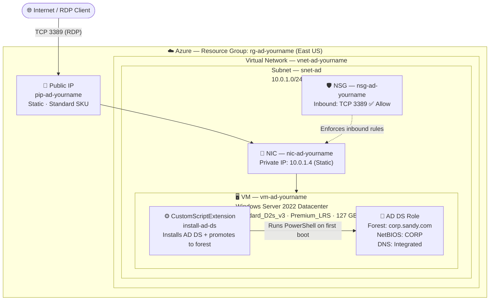
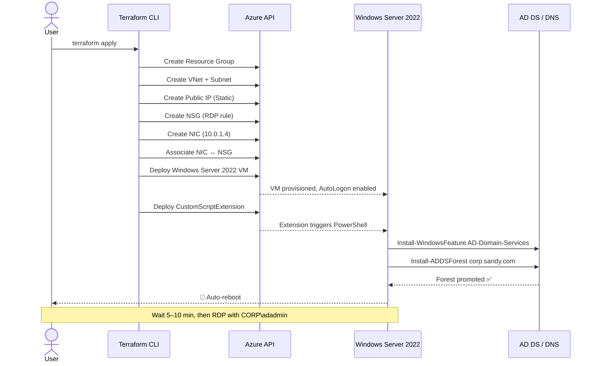

# 🏛️ Architecture Diagram — Azure AD Domain Controller Lab

> Visual reference for all infrastructure deployed by this Terraform lab.
> All resources are provisioned in a single `terraform apply`.

---

## 🗺️ High-Level Architecture

This lab provisions a fully automated Active Directory environment on Microsoft Azure using Terraform as the sole deployment tool. 
At its core, a Windows Server 2022 virtual machine sits inside a dedicated Virtual Network (10.0.0.0/16), isolated within a single subnet (10.0.1.0/24) and protected by a Network Security Group that permits inbound RDP traffic on port 3389. 
The VM is assigned a static private IP (10.0.1.4) via its network interface and is reachable from the internet through a Standard Static Public IP. 
Once the VM is online, a Custom Script Extension automatically executes a PowerShell command that installs the AD DS role, configures integrated DNS, and promotes the server to the root of a new Active Directory forest (corp.sandy.com, NetBIOS: CORP) — all within a single terraform apply, requiring no manual post-deployment configuration.


---

## 🔄 Deployment Flow



---

## 🧱 Resource Inventory

|# | Resource Type | Name |	Key Properties |
|--------|--------|--------|--------|
|1 |Resource Group |	rg-ad-<yourname>	|Region: East US|
|2 | Virtual Network |	vnet-ad-<yourname>	| Address space: 10.0.0.0/16|
|3 |	Subnet	| snet-ad	| Prefix: 10.0.1.0/24 |
|4 |	Public IP	| pip-ad-<yourname>	| Allocation: Static · SKU: Standard |
|5 |	Network Security Group |	nsg-ad-<yourname>	| Inbound: TCP 3389 Allow (priority 1000)|
|6 |	Network Interface	| nic-ad-<yourname>	| Private IP: 10.0.1.4 (Static) |
|7 |	NIC ↔ NSG Association	| (auto)	| Links NIC to NSG | 
|8 |	Windows Virtual Machine |	vm-ad-<yourname> |	Size: Standard_D2s_v3 · OS: WS 2022 Datacenter · Disk: Premium_LRS 127 GB |
|9 |	VM Extension	| install-ad-ds	| Type: CustomScriptExtension 1.10 · Publisher: Microsoft.Compute |

---

## 🌐 Network Layout


---

## 🔐 Active Directory Structure


```


---

## ⏱️ Provisioning Timeline

```powershell
terraform apply
│
├── [0–2 min]   Resource Group, VNet, Subnet, Public IP, NSG, NIC
├── [2–7 min]   Windows Server 2022 VM deployment
├── [7–10 min]  CustomScriptExtension runs PowerShell
│               ├── Install-WindowsFeature AD-Domain-Services
│               ├── Import-Module ADDSDeployment
│               └── Install-ADDSForest corp.sandy.com
└── [10–15 min] 🔁 Automatic reboot → Domain Controller ready

```

✅ RDP is available ~5–10 minutes after terraform apply completes.
Connect using CORP\adadmin after the reboot finishes.

---

